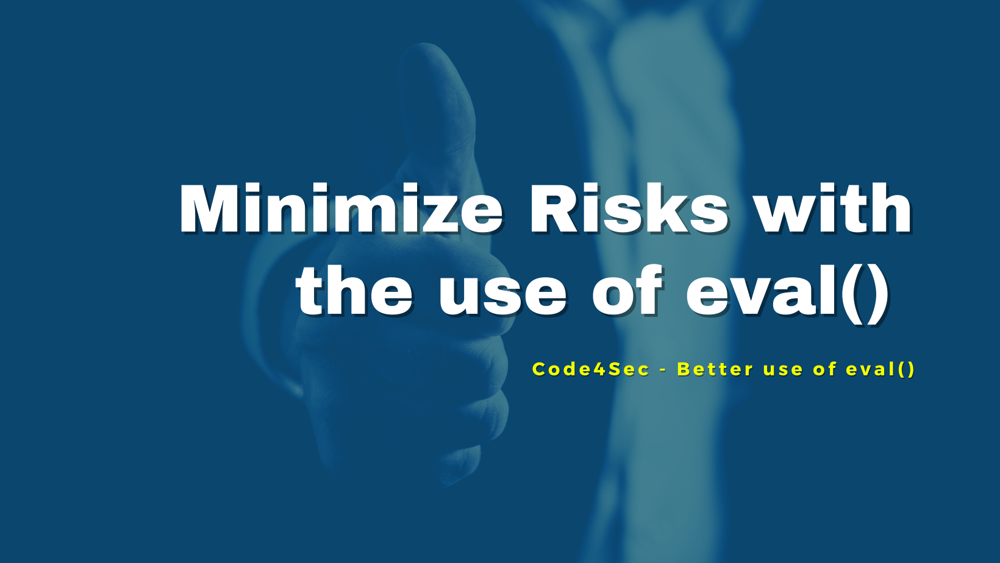

## Welcome to 6th episode of my series **Code for Security**.  

  
  
  
Dangerous functions in Python like **eval()** can be used to achieve authentication bypass and even code injection. However, this episode I will tell you **how to use it safely and effectively** to evaluate arbitrary Python expressions.  
  

______________________________
<table border="0">
 <tr>
   <td> <h3><i>Although my profile picture is quiet, but the real me can make some noise.</i></h3>
      

      <b> Author: Vuttawat Uyanont </b>   
      <i>Sexiest former engineer & banker who interested in Tech, Sake, and Beer.</i>   
      <b>Studying:</b> Master Computer Science in Cybersecurity Management at Mahanakorn University.    </td>  
   <td></td>  
 </tr>
</table>
  
