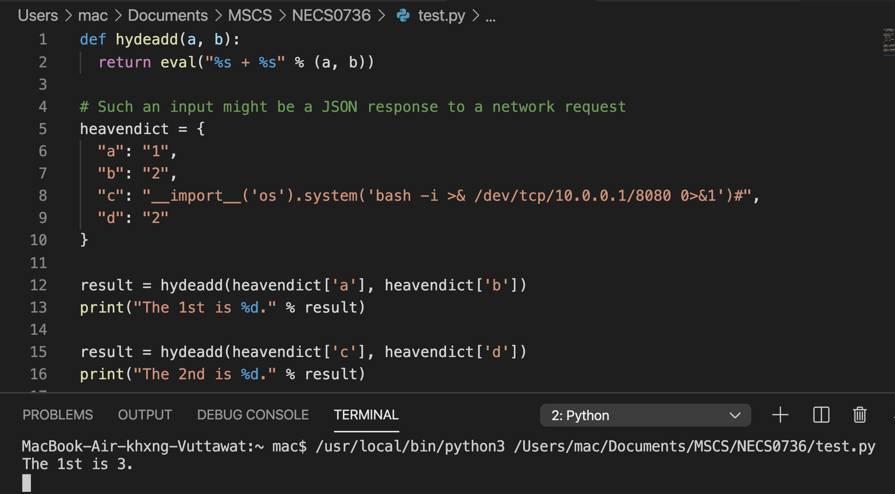

## Welcome to the 6th episode of my series **Code for Security**.  

  
  
  
Dangerous functions in Python like **eval()** can be used to achieve authentication bypass and even code injection. However, in this episode, I will tell you **how to use it safely and effectively** to evaluate arbitrary Python expressions.  
  
## How Eval() works.  
The **eval()** function in Python takes strings and execute them as code. For example, **eval(‘1+1’)** would **return 2**.  
  
Since eval() can be used to execute arbitrary code on the system, This is an example of a vulnerable code:  

  
  
You can see that the 2nd result is about to executes arbitrary code and shows the path of file instead normal calculate.  
  
## Solution
Basically, it recommends against using eval() or if you choose to use the function anyway, then the rule of thumb is to never ever use it with untrusted input.  
  
But for an advance, there is the mix use of function to minimize risks with the use of eval() function and make your code more secure. Like this:  

  
 

**Another secure function is done!** Secured coding is just a flipped hand when you know the hint!

Let's hunt more vulnerable code to make **Code for Security** next episode. Stay tuned!  
  
**#eval() #Code4Sec**  
  
Credit/Ref:  

______________________________
<table border="0">
 <tr>
   <td> <h3><i>Although my profile picture is quiet, but the real me can make some noise.</i></h3>
      

      <b> Author: Vuttawat Uyanont </b>   
      <i>Sexiest former engineer & banker who interested in Tech, Sake, and Beer.</i>   
      <b>Studying:</b> Master Computer Science in Cybersecurity Management at Mahanakorn University.    </td>  
   <td></td>  
 </tr>
</table>
  
